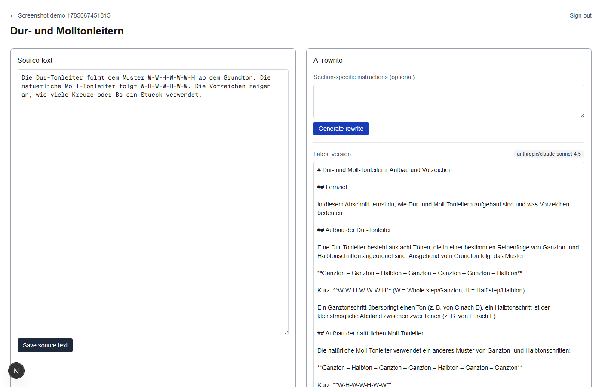

# Script Rewriter

An authenticated, multi-user web app for rewriting educational course scripts with AI.

Users create private projects, add source sections from existing course material, define pedagogical rewriting rules, generate improved versions through OpenRouter, edit and approve a version, and assemble approved sections into a printable script.

## Why AI is core

The app exists to transform weakly structured teaching material into clearer, more educational text. Without the LLM-powered rewrite, the product would be only a document-storage interface — removing the AI feature leaves the app with no reason to exist.

## Sprint scope

### Included

- Supabase sign-up, sign-in, sign-out
- Protected application routes (every route and resource, not just the dashboard)
- Per-user projects with Row Level Security
- Source sections entered as Markdown or plain text
- Project-wide rewriting instructions
- Section-specific rewrite instructions
- Server-side OpenRouter model call
- Saved rewrite versions
- Manual editing and approval of one version per section
- Project preview containing approved sections
- Browser print / Save as PDF
- Visible model name
- Cross-user privacy check

### Deliberately excluded from the MVP

- RAG, embeddings, and pgvector
- Automatic PDF parsing or PDF storage
- Automatic extraction or interpretation of musical notation
- Shared collaborative projects
- Real-time co-editing
- Production-quality typesetting

Source text is pasted or typed as Markdown/plain text; there is no PDF upload or storage in this MVP. Images are represented with preserved placeholders such as:

```md
[FIGURE: C-major scale on keyboard — source page 1]
```

## Suggested stack

- Next.js with App Router and TypeScript
- Tailwind CSS
- Supabase Auth, Postgres, and RLS
- OpenRouter through the OpenAI-compatible API
- Vercel deployment (stretch goal — see below)
- Playwright CLI for critical end-to-end tests

## Core user flow

1. Sign in (or create an account — sign-in and sign-up are separate pages, `/login` and `/signup`).
2. Create a project.
3. Set project-wide rewriting rules.
4. Add a source section.
5. Add optional section-specific instructions.
6. Generate an AI rewrite.
7. Edit or regenerate the output.
8. Save and approve a version.
9. Preview all approved sections.
10. Print or save the preview as PDF.

Projects and sections can also be deleted (with confirmation); deleting a project deletes its sections and rewrite versions, and deleting a section deletes its rewrite versions, via the database's `on delete cascade` foreign keys.

## Data model

- `projects`: project metadata and persistent rewriting rules
- `sections`: source text, title, ordering, and optional manual page references
- `rewrite_versions`: generated or manually edited versions

Every user-data table has RLS enabled and owner-scoped policies. No service-role key is needed anywhere in the app — every path runs through the authenticated user's own session.

## Local setup

### 1. Install dependencies

```bash
npm install
```

### 2. Create environment variables

Copy `.env.example` to `.env.local`:

```bash
cp .env.example .env.local
```

Fill in the values from Supabase and OpenRouter.

### 3. Create Supabase tables and policies

Run the SQL migration in:

```text
supabase/migrations/001_initial_schema.sql
```

### 4. Start the app

```bash
npm run dev
```

Open `http://localhost:3000`.

## Required environment variables

```env
NEXT_PUBLIC_SUPABASE_URL=
NEXT_PUBLIC_SUPABASE_ANON_KEY=
OPENROUTER_API_KEY=
OPENROUTER_MODEL=anthropic/claude-sonnet-4.5
NEXT_PUBLIC_APP_URL=http://localhost:3000
```

`OPENROUTER_API_KEY` is server-only and must never use the `NEXT_PUBLIC_` prefix. Do not expose a Supabase service-role key to browser code — this app does not need one.

## OpenRouter integration

All model calls must happen in a server action or route handler. The browser sends source text and instructions to the application server; the server calls OpenRouter and returns the rewritten text.

Use a single adapter such as:

```ts
export async function rewriteSection(input: RewriteInput): Promise<RewriteResult>
```

The rest of the application must not depend on provider-specific response objects.

## Rewrite prompt contract

The model must:

- preserve the factual scope of the source unless explicitly asked to expand it;
- improve explanation, structure, and sequencing;
- define terminology before relying on it;
- avoid presenting subjective associations as definitions;
- preserve figure placeholders exactly;
- avoid inventing citations, examples, notation, or source claims;
- return only the rewritten section, not commentary about the rewrite.

See `prompts/system-prompt.md`.

## Security acceptance criteria

- Signed-out visitors are redirected away from every protected route and resource — not only `/dashboard`, but every project, section, and preview URL. (All model calls happen through server actions, not a dedicated route handler — there is no `/api/rewrite` endpoint to separately protect.)
- User A cannot list, read, update, or delete User B's projects, sections, or rewrite versions.
- Every user-data table has RLS enabled.
- No service-role key appears in client-accessible code or variables.
- The OpenRouter key exists only in server-side configuration.

## Testing

Run:

```bash
npm run lint
npm run typecheck
npm run test:e2e
```

The critical Playwright scenarios are documented in `docs/TEST_PLAN.md`.

## Deployment (stretch goal)

Deployment to Vercel is a Medium-tier optional task, not a mandatory requirement — the brief allows verification against the locally running app instead. Build and verify the mandatory scope and at least one optional task locally first; only attempt Vercel deployment if time remains.

If deployed: configure the environment variables in the Vercel dashboard and verify in a new incognito window that protected routes redirect to sign-in rather than showing any data.

## Sprint evidence

Before submission, ensure the repository contains:

- `README.md`
- `CLAUDE.md`
- `AGENTS.md`
- `docs/REFERENCES.md`
- at least one merged pull request with the AI code-review report recorded
- a screenshot showing a real rewrite in the running app
  
- evidence of an incognito signed-out check
- evidence of a cross-user privacy check

## Optional features targeted

- Easy: model display
- Medium: tuned system-prompt persona
- Bonus: cross-user privacy test

Stretch, only if time remains after the above: Medium Playwright coverage for the AI happy path and signed-out lockout, then Vercel deployment.

## Efficient testing workflow

This project uses targeted testing to fit the sprint deadline:

- Vitest for prompt construction, validation, parsing, placeholder preservation, and approval logic;
- three focused Playwright journeys for signed-out lockout, the rewrite happy path, and cross-user isolation;
- deterministic mocked AI output for normal automated tests;
- one separate live OpenRouter integration check;
- Playwright CLI only. Playwright MCP is avoided entirely except as a last resort for a genuinely stuck debugging session — it is too slow and token-heavy for routine use.

Run focused tests during development and the full suite only at milestones. See `AGENTS.md` and `docs/TEST_PLAN.md`.
